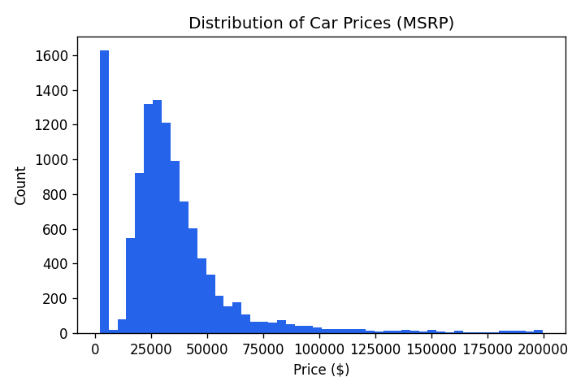
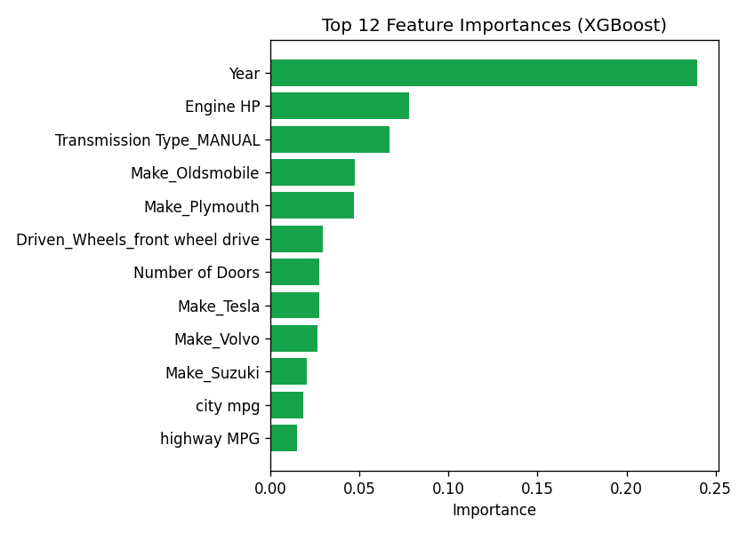

# 🚗 Used Car Price Predictor

An end-to-end machine learning project that predicts the resale price of a car
from its specifications (make, year, engine, transmission, fuel economy, etc.),
deployed as an interactive web app.

**Live demo:** _[add your Streamlit Cloud link here after deployment]_



## Problem

Used-car pricing is one of the most common real-world regression problems in
the automotive industry — dealerships and marketplaces need a reliable way to
estimate a fair price for a vehicle based on its attributes. This project
builds and compares several regression models to solve that problem, then
ships the best one as a usable app.

## Dataset

~11,900 car listings with 16 attributes (make, model, year, engine specs,
transmission, drivetrain, body style, fuel economy, and MSRP).
Source: ["Car Features and MSRP"](https://www.kaggle.com/datasets/CooperUnion/cardataset)
dataset (also mirrored in [mlbookcamp-code](https://github.com/alexeygrigorev/mlbookcamp-code)).

## Approach

1. **Cleaning & feature selection** — kept 11 predictive features (numeric +
   categorical), dropped high-cardinality / sparse columns (`Model`,
   `Market Category`), removed a small number of extreme outlier (>$200k)
   listings.
2. **Target transform** — applied `log1p` to `MSRP` since price is strongly
   right-skewed, then reversed it (`expm1`) at prediction time.
3. **Preprocessing pipeline** — `ColumnTransformer` with median imputation +
   scaling for numeric features, most-frequent imputation + one-hot encoding
   for categorical features, wrapped in a single `sklearn.Pipeline` so
   preprocessing and model travel together as one saved artifact.
4. **Model comparison** — trained Linear Regression, Random Forest, and
   XGBoost, evaluated on a held-out 20% test split.

| Model              | RMSE (test) | R² (test) |
|--------------------|------------:|----------:|
| Linear Regression  |     $14,922 |    0.682  |
| Random Forest       |      $5,487 |    0.957  |
| **XGBoost (best)** |      **$4,865** |    **0.966**  |



`Year` and `Engine HP` are the strongest predictors of price, followed by
transmission type and brand.

## Tech Stack

- **Python**, **pandas** / **NumPy** — data handling
- **scikit-learn** — preprocessing pipeline, Linear Regression, Random Forest
- **XGBoost** — gradient-boosted regressor (best-performing model)
- **Streamlit** — interactive web app for inference
- **joblib** — model serialization

## Project Structure

```
car-price-prediction/
├── app.py                  # Streamlit app
├── train.py                 # Data prep + model training/comparison
├── requirements.txt
├── data/
│   └── car_data.csv
├── models/
│   ├── model.pkl            # Saved best pipeline (preprocessing + XGBoost)
│   ├── options.json         # Dropdown/range metadata for the app form
│   └── metrics.json         # Test metrics for each model
└── assets/                  # Charts used in this README
```

## Run It Locally

```bash
git clone https://github.com/<your-username>/car-price-prediction.git
cd car-price-prediction
pip install -r requirements.txt

# (optional) retrain the model from scratch
python train.py

# launch the app
streamlit run app.py
```

## Deployment

Deployed for free on **Streamlit Community Cloud**, connected directly to
this GitHub repo — every push to `main` redeploys the app automatically.

## Possible Improvements

- Add more recent listings / a larger dataset for better generalization
- Hyperparameter tuning (GridSearchCV / Optuna) for the XGBoost model
- Add SHAP-based explanations so each prediction shows *why* the model
  priced the car the way it did
